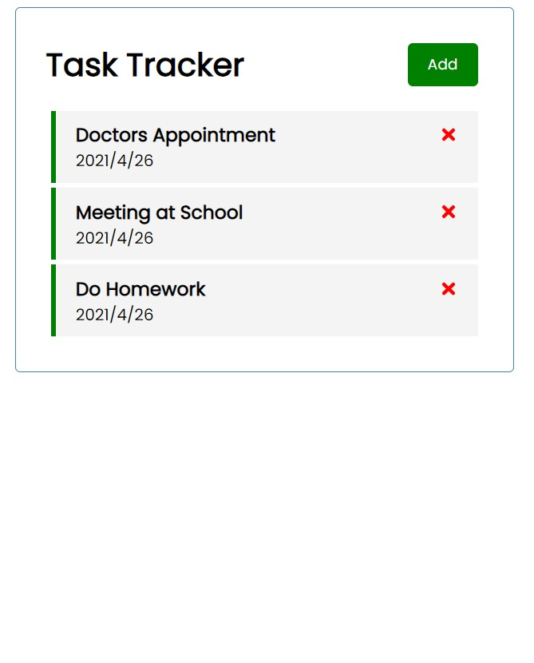
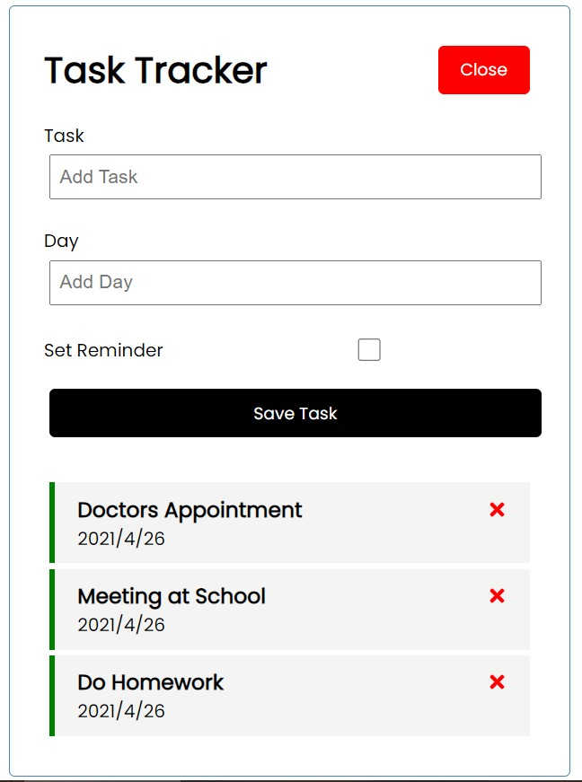

<!--
 * @Author: Liu Yuchen
 * @Date: 2021-04-27 23:35:08
 * @LastEditors: Liu Yuchen
 * @LastEditTime: 2021-04-28 02:57:23
 * @Description: 
 * @FilePath: /taskTracker/README.md
 * @GitHub: https://github.com/liuyuchen777
-->
# Task Tracker

## Introduction

A simple react demo for to-do list liked task tracker

function include:
* add task
* delete task
* label task as done

## How to use

```bash
# install package
yarn 
# run project
yarn start
```

## demo pictures



